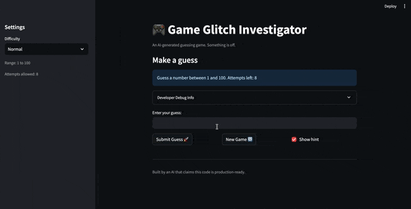

# 🎮 Game Glitch Investigator: The Impossible Guesser

## 🚨 The Situation

You asked an AI to build a simple "Number Guessing Game" using Streamlit.
It wrote the code, ran away, and now the game is unplayable. 

- You can't win.
- The hints lie to you.
- The secret number seems to have commitment issues.

## 🛠️ Setup

1. Install dependencies: `pip install -r requirements.txt`
2. Run the broken app: `python -m streamlit run app.py`

## 🕵️‍♂️ Your Mission

1. **Play the game.** Open the "Developer Debug Info" tab in the app to see the secret number. Try to win.
2. **Find the State Bug.** Why does the secret number change every time you click "Submit"? Ask ChatGPT: *"How do I keep a variable from resetting in Streamlit when I click a button?"*
3. **Fix the Logic.** The hints ("Higher/Lower") are wrong. Fix them.
4. **Refactor & Test.** - Move the logic into `logic_utils.py`.
   - Run `pytest` in your terminal.
   - Keep fixing until all tests pass!

## 📝 Document Your Experience

- [ ] Describe the game's purpose.
  
  it's a fun game to guess the number. There are few hints provided which you can use to guess the number in few attempts. 

- [ ] Detail which bugs you found.
  
  The main bugs I found were that the secret number was visible in the debug section, the New Game button did not properly reset the game state, and the app allowed invalid guesses like negative numbers even though the guessing range should stay positive. The hint logic was also incorrect because the game sometimes told the player the wrong direction. These issues made the app confusing and stopped the game from working the way it was supposed to.
- [ ] Explain what fixes you applied.

  I moved the reusable game logic into `logic_utils.py` and added pytest tests to verify guess validation, hint behavior, and scoring. I fixed the input validation so guesses must stay inside the selected difficulty range, corrected the higher/lower hint messages, and updated Streamlit session state so New Game resets attempts, score, history, and input correctly. I also removed the secret from the debug display and improved the feedback messages so the app gives clearer responses after each guess.

## 📸 Demo

- [x] Winning game demo

## 🚀 Stretch Features

- [ ] [If you choose to complete Challenge 4, insert a screenshot of your Enhanced Game UI here]
